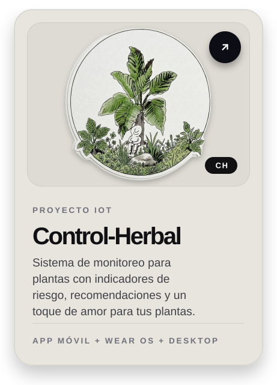
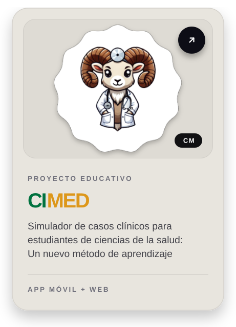

  

---

## 
 Sobre mí

Estudiante de **Ingeniería en Software** en la Universidad Autónoma de Baja California (UABC), con base técnica en **Python, Java, C++, Kotlin y SQL**, y experiencia práctica en desarrollo de aplicaciones **Android** y diseño web con **HTML, CSS, JavaScript y React**.

Combino fundamentos sólidos de programación con experiencia previa en soporte técnico, redes LAN y gestión de infraestructura de TI — una perspectiva integral que une el desarrollo de software con la operación de sistemas. Actualmente exploro **IoT, Docker y desarrollo de videojuegos**, y estoy detrás de dos proyectos: [Control-Herbal](https://github.com/Dominatricxx/Control-Herbal), un sistema de monitoreo de plantas con ESP32 e inteligencia artificial, y [CIMED](https://github.com/Dominatricxx/CIMED), un simulador de casos clínicos para estudiantes de ciencias de la salud con app Android y versión web sobre Supabase.

Tijuana, Baja California, México · Aprendizaje rápido y orientado a resultados

---

## Tecnologías

| Web | Programación & DB | Móvil, Juegos, IoT & IA | Herramientas |
| :---: | :---: | :---: | :---: |
|  |  |  |  |

---

## Proyectos destacados

 <table> <tr> <td width="300px" align="center">  </td>
<td width="300px" align="center">  </td> </tr> </table> 

---

## Educación & Experiencia

<table align="center">
<tr>
<td valign="top" width="50%">

**Educación**

**Ingeniería en Software**
Universidad Autónoma de Baja California (UABC)
`Ago. 2023 – Presente`

**Técnico en Programación**
CECyTE Baja California
`Feb. 2016 – Jun. 2019`

</td>
<td valign="top" width="50%">

**Experiencia**

**Asistente de TI**
Prestige Call Center · `Oct. 2021 – Feb. 2022`
- Soporte técnico y mantenimiento de hardware/software
- Configuración y administración de red LAN
- Estandarización del setup de equipos para nuevos usuarios
- Gestión remota e inventario de equipo tecnológico

</td>
</tr>
</table>

---

## Certificaciones

[-0F2027?style=for-the-badge&logo=freecodecamp&logoColor=7AA2F7)](https://www.freecodecamp.org/certification/fcc-1b906123-662d-437c-a7e9-93e6ec504c90/python-v9)

---

Gracias por visitar mi perfil :)

